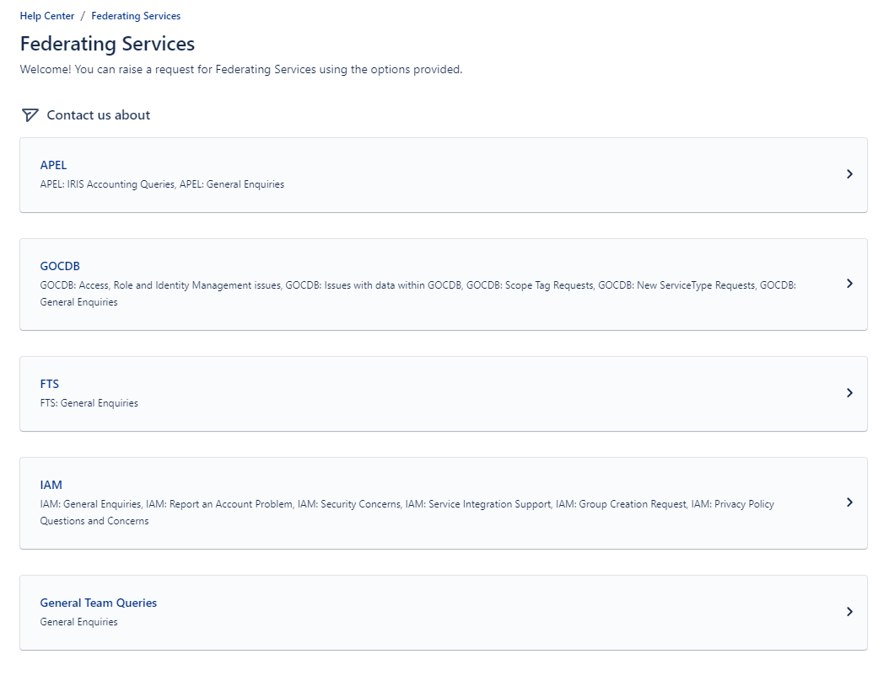

# STFC SCD Help Center Guide
Below is a guide on how to use the STFC SCD Help Centr request for support from STFC federating service team. Having an account will allow you to file and track your request more easily.

You can:

- [Sign Up as Customer](#sign-up-for-scd-help-center)
- [Raise a request](#raising-a-request-for-iris-iamska-iam)
- [Track your request](#tracking-a-request-for-iris-iamska-iam)

## Sign Up for SCD Help Center
1. Visit the [STFC SCD Federating Service Team Help Center](https://stfc.atlassian.net/servicedesk/customer/portal/31)
2. You will be asked to login with a email and if you are not signed up, you will be asked to sign-up with a email.
    <figure markdown="span">
        { width="300" }
        <figcaption>Login for help center</figcaption>
    </figure>
    <figure markdown="span">
        { width="300" }
        <figcaption>Register for help center</figcaption>
    </figure>
3. You will recieve a email tittled `Finish signing up to Help Center` in your email. Please click `Sign up` to continue your registration
4. Please set a name and a password
    <figure markdown="span">
        { width="300" }
        <figcaption>Form to register for help center</figcaption>
    </figure>
5. The accont is created and you will have access to the STFC SCD Help center

## Raising a request for IRIS IAM/SKA IAM
1. Navigate to [STFC SCD Federating Service Team Help Center](https://stfc.atlassian.net/servicedesk/customer/portal/31) or select `Federating Service`
2. Select *IAM* 
    <figure markdown="span">
        { width="300" }
        <figcaption>Federating Service help center</figcaption>
    </figure>
3. Select the catagories of request you want to raise.
4. Please add discription and pictures/files if it will aid the diagnosis of your issue
    <figure markdown="span">
        { width="300" }
        <figcaption>Request filing form</figcaption>
    </figure>
5. Press *Send* and the request will be processed by the On-duty team in line with the SLA
6. You should get a automatic response in your email after submitting the request.

## Tracking a request for IRIS IAM/SKA IAM
1. Click on your user icon on the top right corner and click *Requests*.
    <figure markdown="span">
        { width="300" }
        <figcaption>Tracking request</figcaption>
    </figure>
2. You will see a list of ticket raised in your name along with the status.
    <figure markdown="span">
        { width="300" }
        <figcaption>Your request list</figcaption>
    </figure>
3. Click on the ticket to view more detailed correspondent.