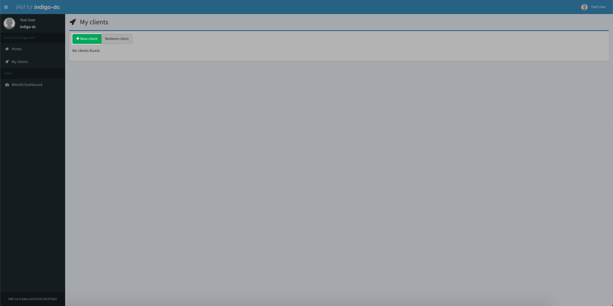
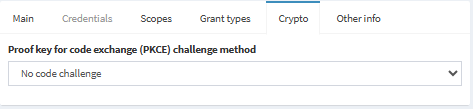

# IAM Clients

The IAM offers OpenID Connect/OAuth client which users can use.

## Creating Clients
1. Log into the service and click on the *My Clients* tab
2. You can create a new client using the *+New client* button.
    <figure markdown="span">
        { width="300" }
        <figcaption>Create Client button</figcaption>
    </figure>
3. You can do some basic configurations before creating the client
4. You can finalise the client creation with *Save client* button and the client secret will be generated.
    <figure markdown="span">
        { width="300" }
        <figcaption>Save Client button</figcaption>
    </figure>
5. Youe can retrieve the client secret for use in your application via clicking the client > *Credentials* > *Client secret*

## Clients Configuration
This section will go through key configuration for the client.
### Main
- **Client name**: Human readable name of client, non-unique
- **Client id**: Unique ID of your clients
- **Redirect URIs**: List of allowed Redirect URI for the clients usually pointing to your application.
- **Contacts**: Email contacts for admin of the Client
    <figure markdown="span">
        { width="300" }
        <figcaption>Client Info - Main</figcaption>
    </figure>

### Credentials
- **Token endpoint authentication method**: Authentication method of your application
- **Client secret**: The secret of the client
    <figure markdown="span">
        { width="300" }
        <figcaption>Client Info - Credentials</figcaption>
    </figure>

### Scopes
You can use the scopes avaliable for the IAM or build your own custom scopes.
    <figure markdown="span">
        { width="300" }
        <figcaption>Client Info - Scopes</figcaption>
    </figure>

#### JWT profiles
A JWT profile is a named set of rules that defines which information is included in access tokens, id tokens, userinfo and introspection responses issued by IAM in an OAuth/OIDC message exchanges.

There are 4 unique scopes that set the token profile used in the client, Please only enable 1 in any client:

- **aarc**: AARC token profile
- **iam**: INDIGO IAM token profile
- **wlcg**: WLCG token profile
- **kc**: keycloak token profile

???+ info
    You should **only enable 1 of the above scopes**, enabling multiple will cause the IAM to default back to the system default, INDIGO IAM token profile.

### Grant types
Controls the Grant types of the client
    <figure markdown="span">
        { width="300" }
        <figcaption>Client Info - Grant types</figcaption>
    </figure>

### Crypto
PKCE information
    <figure markdown="span">
        { width="300" }
        <figcaption>Client Info - Crypto</figcaption>
    </figure>

### Other info
Additional information for your client
    <figure markdown="span">
        { width="300" }
        <figcaption>Client Info - Other info</figcaption>
    </figure>

## Editing a client
1. You can click on the name of the client or the 🖉 icon. 
    <figure markdown="span">
        { width="300" }
        <figcaption>Edit Client</figcaption>
    </figure>
2. After you have made the change, you can press *Save client* to confirm the change

## Deleting a client
1. You can click on ✘ button
    <figure markdown="span">
        { width="300" }
        <figcaption>Delete Client</figcaption>
    </figure>

2. In the popup click *Delete client* to confirm the delete
    <figure markdown="span">
        { width="300" }
        <figcaption>Delete Client popup</figcaption>
    </figure>

