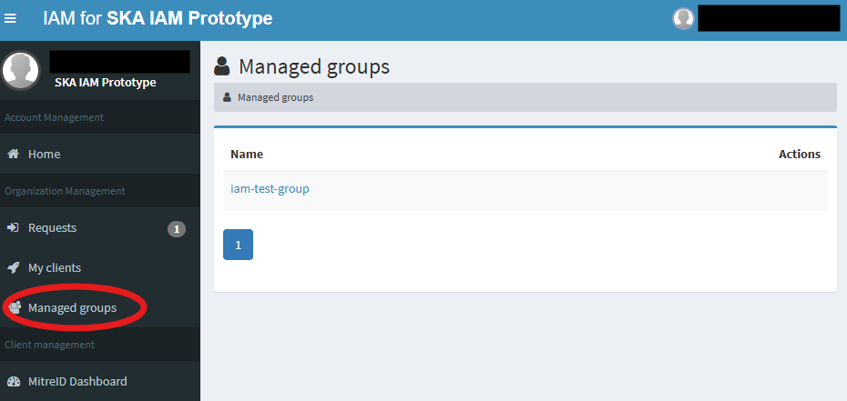
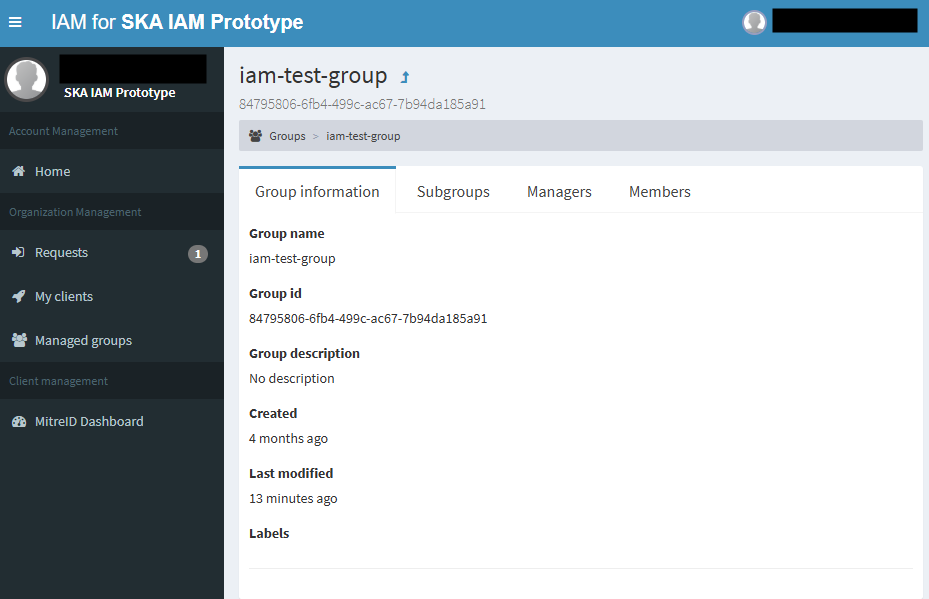
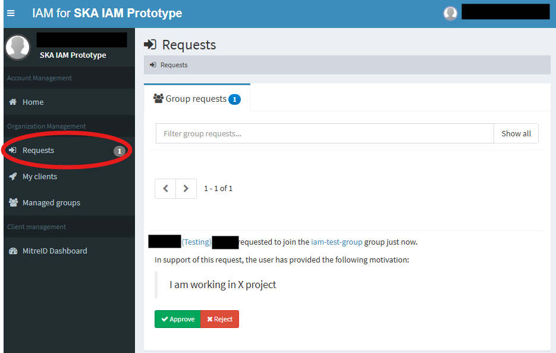
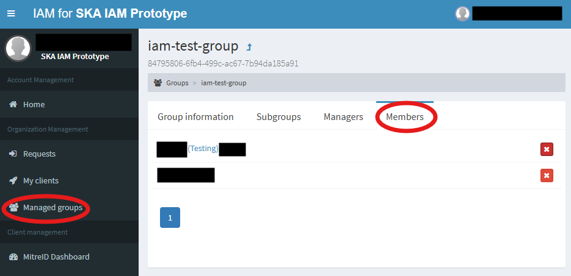
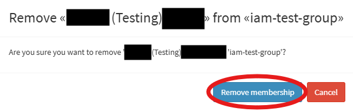

# Groups Management Guide
This section is for users who wish to create and manage a group within IRIS IAM/SKA IAM

## Creating a group
1. Please file a ticket to the IAM Admin team using the [Contact Us](../../contact-us/index.md) information, with the following.
    - Full group name
        - If it is a subgroup, denote it using `{groups}/{sub-groups}` as stated in the [AARC specification, AARC-G069](https://aarc-community.org/guidelines/aarc-g069/)
    - The purpose of the group
    - Nominate **minimum 2 - 3 group managers** to process your user request
        - Please note that you will need to file a ticket to [IAM Admin](../../contact-us/index.md) to add or remove group managers after the groups initial creation.
2. Your request will be handled by the On-Duty team.

## Managing a group
You can use the *Managed groups* tab to list groups which you have been assigned as group managers.
    <figure markdown="span">
        { width="300" }
        <figcaption>List of group managed screen</figcaption>
    </figure>
You can also click on each group to see further information such as detailed group information, subgroups, list of group managers of the group and list of group members of the group
    <figure markdown="span">
        { width="300" }
        <figcaption>Group detail information</figcaption>
    </figure>
### Accepting/rejecting group membership request
1. The process to join a group needs to be initiated by a user via [Joining a Group](./group-user-guide.md#joining-a-group) where they make a request.
2. Once they have made the request, you can view the pending request in in the *Requests* tab where you will be able to see the username and the justification for joining the group.
    a. You will also recieve a email notification from IAM in your registered email.
        <figure markdown="span">
            { width="300" }
            <figcaption>Group request management screen</figcaption>
        </figure>
3. You can either click on *✔Approve* to accept the request or *✘Reject* to reject the request. The IAM service management team recommands that all group membership request should be processed within 4 working days.

### Removing group membership of a user
1. Go to *Managed Groups* > *<the-group-concerned>* > *Members*
    <figure markdown="span">
        { width="300" }
        <figcaption>Member management screen</figcaption>
    </figure>
2. Click the ✘ next to the username of the user to remove group membership of that user.
3. Confirm the removal.
    <figure markdown="span">
        { width="300" }
        <figcaption>Confirm membership remove</figcaption>
    </figure>
4. The person is removed from the group.