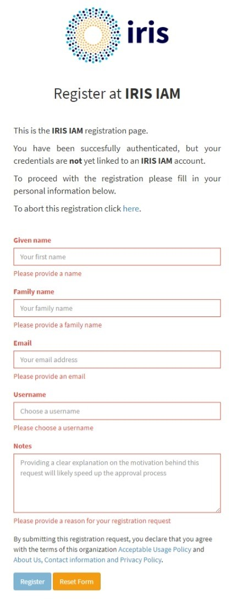

# Registering an Account

## Introduction
The IRIS IAM and SKA IAM provides an authentication and authorization service to a number of IRIS and SKA resources. 

The primary way of doing this is by **creating an account associated with a users home instiution identity ([eduGAIN](https://edugain.org/))**. By associating accounts with instiutional identities, it ensures that all members have an active affiliation with an IRIS or SKA partner at sign-in time.

Please note that all account requests require a member of the IAM admin team to approve them before they are activated. We endeavour to approve requests within **4 working hours** of recievining the request. Any requests made during the evening or over the weekend will likely see delays.

## Registration Process

There are 2 ways to register for IRIS IAM/SKA IAM:

- [Using eduGAIN IdP **(Recommended)**](#registration-using-edugain-idps-recommended)
- [Requesting a local account](#local-account-registration)

### Registration using [eduGAIN](https://edugain.org/) IdPs **(Recommended)**

1. Navigating to the Sutable IAM homepage: [IRIS IAM home page](https://iris-iam.stfc.ac.uk/) or [SKA IAM home page](https://ska-iam.stfc.ac.uk/)
2. Selecting the the `Register an account with eduGAIN` button, as circled in red below.

    <figure markdown="span">
        { width="300" }
        <figcaption>Register an account with eduGAIN</figcaption>
    </figure>

3.  You will be presented with a list of all registered academic institutions. You may start typing the name of your institution here and, if registered with eduGAIN, it will appear in the automatically updated list. 

    <figure markdown="span">
        { width="300" }
        <figcaption>Type to search your home Institution from eduGAIN</figcaption>
    </figure>

    ???+ info
        Please be aware that due to the large number of institutions linked with eduGAIN, you may need to **type several characters** before finding yours. 
        
        Also, please use the **Full English Name** of your institution instead of *acronym*. For example, *Science and Technology Facilities Council* instead of *STFC*

4. You will be redirected to the sign-in portal for your home institution. Once authenticated, you will be asked to allow your institution to release your information to IRIS IAM. Please accept this to proceed.

5. You will be redirected to the registration page, as shown below. This registration page may be filled with information provieded by your IdP. Please fill in any remaining field such as the notes to help the admins to determin your eligibility of an account.

    <figure markdown="span">
        { width="300" }
        <figcaption>IAM Registration form for eduGAIN</figcaption>
    </figure>

    ???+ info
        You may cancel the registration and return to the home page by clicking `To abort this registration click here`

6. Please read the **Acceptable Usage Policy** and **Privacy policy** carefully. 
7. Click `Register` to submit the account request.
8. You will recieve an email to verify your email account. Please click on the link to confirm your registration request. 
    
    ???+ info
        Please check your **Spam/Trash** folder and add the `iris-iam-support@gridpp.rl.ac.uk` to the **whitelist** if this is the case as you will also recieve news about your account and groups via this email.

9. Your request will be passed to the on-duty admin team and we aim to process your request within **4 working hours**.

### Local Account Registration
This create a local IRIS IAM/SKA IAM account which will only be granted with a **valid reason**.

1. Navigating to the Sutable IAM homepage: [IRIS IAM home page](https://iris-iam.stfc.ac.uk/) or [SKA IAM home page](https://ska-iam.stfc.ac.uk/)
2. Selecting the the `Apply for an account` button, as circled in blue below.
    <figure markdown="span">
        { width="300" }
        <figcaption>IAM local registration buttion</figcaption>
    </figure>

3. You will be redirected to the registration page, as shown below. Please fill in the fields such as the notes to help the admins to determin your eligibility of an account.
    <figure markdown="span">
        { width="300" }
        <figcaption>IAM local registration page</figcaption>
    </figure>

4. Please read the **Acceptable Usage Policy** and **Privacy policy** carefully. 
5. Click `Register` to submit the account request.
6. You will recieve an email to verify your email account. Please click on the link to confirm your registration request.
    
    ???+ info
        Please check your **Spam/Trash** folder and add the `iris-iam-support@gridpp.rl.ac.uk` to the **whitelist** if this is the case as you will also recieve news about your account and groups via this email.

7. Your request will be passed to the on-duty admin team and we aim to process your request within **4 working hours**.