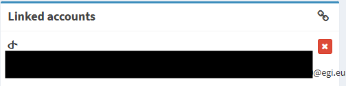

# Link External Account
This section guides user through how to link and unlink an account from external IdP after registration or repair it.

## Adding a linked account
1. Login to IRIS IAM or SKA IAM Dashboard.
2. Click *Link external account* Button

    <figure markdown="span">
        { width="300" }
        <figcaption>Link external account button</figcaption>
    </figure>
3. Select the IdP from the list (eduGAIN in this example)

    <figure markdown="span">
        { width="300" }
        <figcaption>Link external account popup</figcaption>
    </figure>

4. You will be presented with a list of all registered academic institutions. You may start typing the name of your institution here and, if registered with eduGAIN, it will appear in the automatically updated list. 
    <figure markdown="span">
        { width="300" }
        <figcaption>Select your institution</figcaption>
    </figure>

    ???+ info
        Please be aware that due to the large number of institutions linked with eduGAIN, you may need to **type several characters** before finding yours

5. You will be redirected to the sign-in portal for your home institution. Once authenticated, you will be asked to allow your institution to release your information to IRIS IAM. Please accept this to proceed.

6. Your would be redirected to IRIS IAM or SKA IAM

7. You should see your linked IdP appearing in the Linked account sections
    <figure markdown="span">
        { width="300" }
        <figcaption>Your account is linked</figcaption>
    </figure>

## Removing an linked account

???+ Warning
    You will not be able to login to IAM via the linked account after you unlink the account

1. Login to IRIS IAM/SKA IAM and navigate to the dashboard.
2. Click on the *x* button to the right of the account.
    <figure markdown="span">
        { width="300" }
        <figcaption>Unlink account button</figcaption>
    </figure>
3. You will see a popup to confirm your choice.
    <figure markdown="span">
        { width="300" }
        <figcaption>YUnlink account popup</figcaption>
    </figure>
4. Your linked account is removed.

## Repairing a broken account link
Sometimes the Linked account may be broken due to changes made in linked IdP.

If that happens please [Remove](#removing-an-linked-account) and [Add](#adding-a-linked-account) the account again to repair the link
