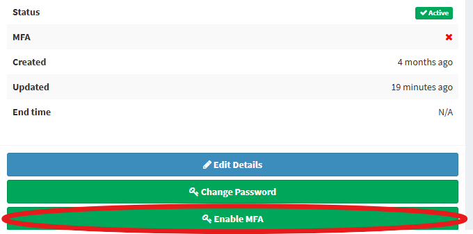
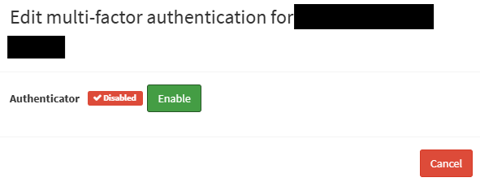
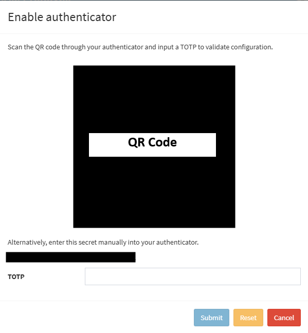
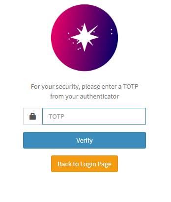
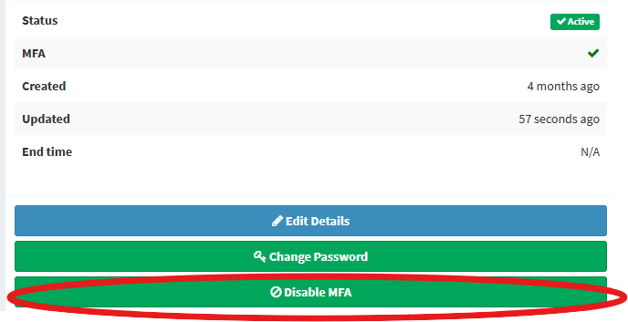
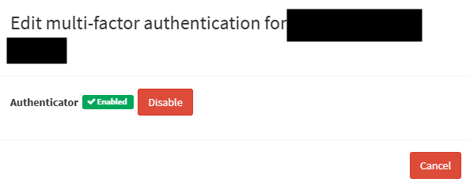
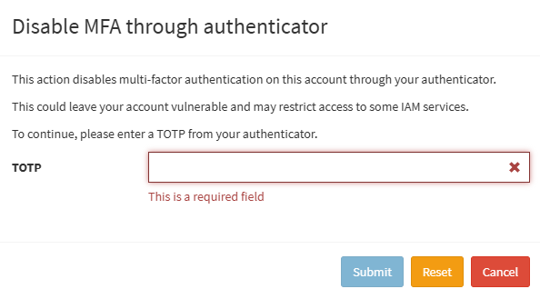

# Multi-factor authentication (MFA)
This is a experimental feature of IAM. If you encounter issues or unable to login. Please contact the IAM Service Team via [Contact Us](../../contact-us/index.md)

## Enabling MFA
1. Login to your IAM account and click *Enable MFA* in the dashboard.
    <figure markdown="span">
        { width="300" }
        <figcaption>Enable MFA button</figcaption>
    </figure>
2. You will see a popup that shows the status of your MFA. Press *Enable* if you wish to enable MFA
    <figure markdown="span">
        { width="300" }
        <figcaption>Enable MFA Popup</figcaption>
    </figure>
3. You will be shown a QR code which can be scanned with any authenticator app such as Microsoft Authenticator or Google Authenticator etc. Alternatively, you can manually input the code to an authenticator app.
    <figure markdown="span">
        { width="300" }
        <figcaption>Enable MFA - Set Up autnenticator Popup</figcaption>
    </figure>
4. You will need to input the TOTP shown from the authenticator to verify that the authenticator has been set up correctly. After that, press *Submit* to continue.
5. MFA is enabled for your account and you will see a additional login screen to put in your TOTP when you login.
    <figure markdown="span">
        { width="300" }
        <figcaption>MFA - TOTP Login</figcaption>
    </figure>

## Disabling MFA
1. Login to your IAM account and click *Disable MFA* in the dashboard.
    <figure markdown="span">
        { width="300" }
        <figcaption>Disable MFA button</figcaption>
    </figure>
2. You will see a popup that shows the status of your MFA. Press *Disable* if you wish to disable MFA
    <figure markdown="span">
        { width="300" }
        <figcaption>Disable MFA Popup</figcaption>
    </figure>
3. You will need to put in the TOTP to confirm that you would like to disable MFA. Then, Press *Submit* to disable MFA
    <figure markdown="span">
        { width="300" }
        <figcaption>Confirm Disable MFA Popup</figcaption>
    </figure>
4. MFA will be disabled for your account.